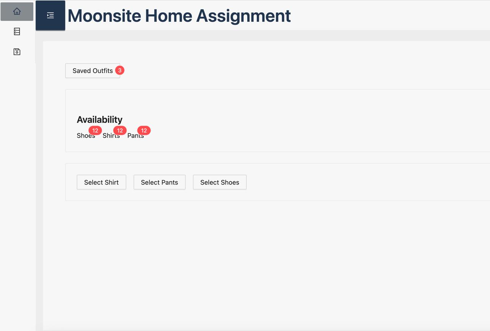
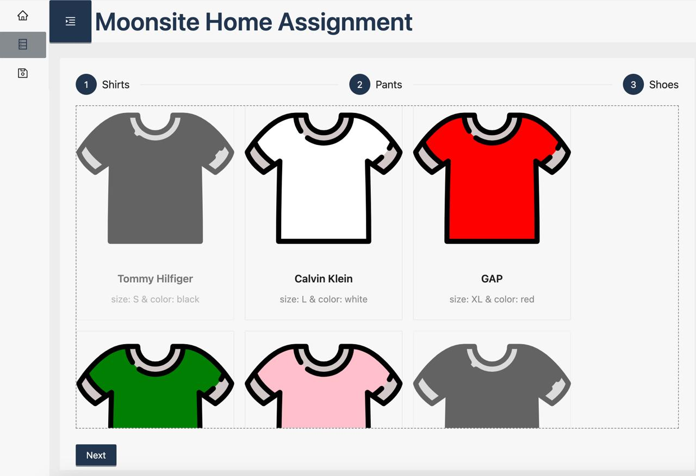
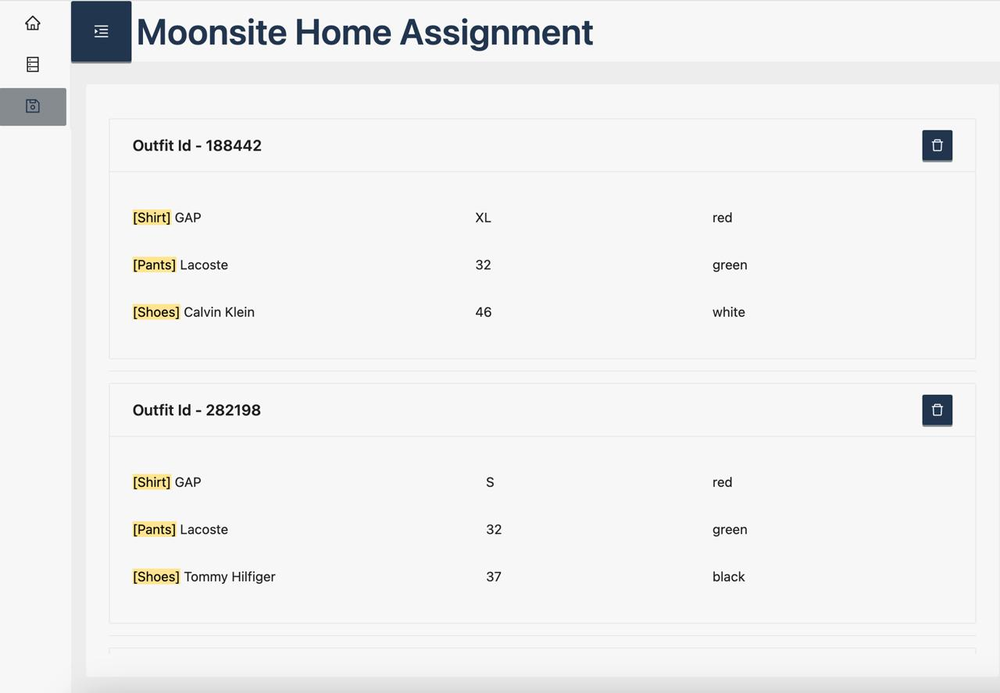

# Moonsite Home Assignment

## Run Locally

Clone the project

```bash
  git clone https://github.com/katyush0611/moonsite-home-assignment.git
```

Go to the project directory

```bash
  cd moonsite-home-assignment
```

Install dependencies

```bash
  npm install
```

Start the server

```bash
  npm run dev
```

Visit App

```bash
localhost:5173/
```

## Tech Stack

**Client:** React, Redux, SCSS, Ant design

## App Content

- Home Page
  

- Outfit Builder Page
  
- Saved Outfits Page
  

## Home Page

#### Features

- Fetch all garments from API service and set the store on init
- Saved outfits count
  - navigate to outfits page on click
- Availble garments count
  - for each garment type
- Button for each garment type
  - on click navigating to outfit builder page and starting the proccess with the chosen garment type.

## OutfitBuilder

#### Custom hooks

| Name                    | Description                                                  |
| :---------------------- | :----------------------------------------------------------- |
| `useOutfitBuilderSteps` | For initial step build                                       |
| `useOutfitSelection`    | Managing the on garment select logic and outfit object build |
| `useRecommendations`    | Managed by useOutfitSelection for inserting recommendations  |

#### Features

- Filters - user can filter garments by 3 parameters: brand, color and size.
- **Recommendations algorithm** - when garment is selected, the app will sort the next outfit builder step garments list by size and color, based on the selected garment size and color. according to the following logic ->

  - By color recommendation util, it basicaly takes a color name and by converting it to rgb maps the availableColors (converting them to) and by calculating the colorDistance we can sort the "more" compatible colors.

  - By Size recommendation with Rule-based system, return an arrays of recommended sizes for each garment type, to later be sorted by in the list component. each garment type has recommendation map

  ```dash
  type RecommendationMap = {
  [key: string]: {
  shirts?: string[];
  pants?: number[];
  shoes?: number[];
  };
  };
  ```

```dash
recommendFromGarmentColor: (props) => string[];
```

| Prop Name         | Type       | Description                             |
| :---------------- | :--------- | :-------------------------------------- |
| `garmentColor`    | `string`   | selected garment color                  |
| `availableColors` | `string[]` | next garment type availble colors       |
| `count`           | `number`   | number of results to return (default 3) |

```dash
  recommendFromGarmentSize: (props) => { pants: number[]; shoes: number[]; shirts: string[] };
```

| Prop Name | Type               | Description                                   |
| :-------- | :----------------- | :-------------------------------------------- |
| `type`    | `GarmentType`      | Garment type ("shirt" \| "pants" \| "shoes" ) |
| `size`    | `string \| number` | selected garment size                         |

### Examples:

```dash
recommendFromGarmentSize("shirt", "S") === {pants: [30, 31], shoes: [36, 37]}

recommendFromGarmentColor("red", ["white", "red", "pink", "green"]) === ["red", "white", "pink"]
```

## Saved Outfits Page

#### Features

- Displays a list of outfits, showing outfit garments and it parameters (brand, size, color)

```dash
interface Outfit {
  id: number;
  shirt: Garment<"shirt">;
  pants: Garment<"pants">;
  shoes: Garment<"shoes">;
}
```
